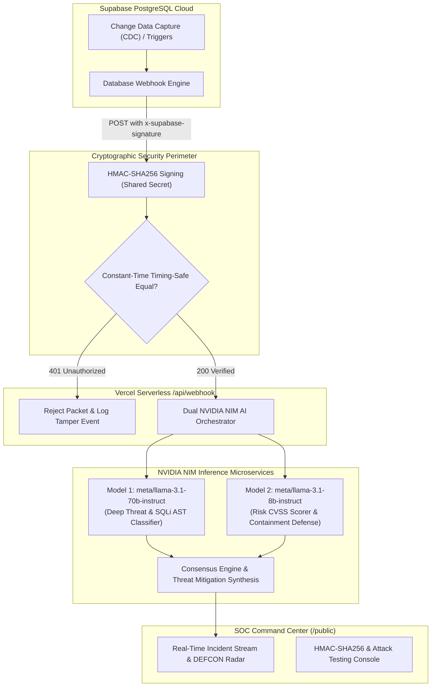

# Supabase Sentinel — Enterprise Database Threat Monitoring & Autonomous Defense

Real-time Database Security Monitoring System built with **Supabase HMAC-SHA256 Authenticated Webhooks**, **Dual NVIDIA NIM AI Threat Intelligence Engines**, and a **Cyber-Defense SOC Dashboard** with automated **Vercel CI/CD via GitHub Actions**.

---

## 🏛️ System Architecture



---

## 🚀 Key Features

1. **HMAC-SHA256 Cryptographic Webhook Authentication**:
   - Every Supabase Database Webhook payload is verified using `crypto.timingSafeEqual` to thwart timing-attacks.
   - Rejects forged headers or tampered payloads with instant `401 Unauthorized`.
2. **Dual NVIDIA NIM AI Intelligence Engines**:
   - **Model 1 (`meta/llama-3.1-70b-instruct`)**: AST SQL syntactic anomaly triage, zero-day injection detection, and privilege escalation recognition.
   - **Model 2 (`meta/llama-3.1-8b-instruct`)**: Risk scoring (CVSS estimation), automated containment playbook (IP quarantine, RLS enforcement, token revocation).
   - **Dual Consensus Matrix**: Calculates agreement percentage to avoid false positives.
3. **Real-time Glassmorphic SOC Dashboard**:
   - Live DEFCON threat level meter.
   - Interactive Webhook & Attack Vector Simulator with valid vs tampered HMAC toggles.
   - Comprehensive telemetry console and drill-down incident drawer.
4. **Automated Vercel CI/CD via GitHub Actions**:
   - Pipeline defined in `.github/workflows/deploy.yml`.
   - Runs automated cryptographic unit tests and deploys directly to Vercel Production on push.

---

## 📂 Project Structure

```
db-security-monitor/
├── .github/
│   └── workflows/
│       └── deploy.yml          # GitHub Actions automated CI/CD pipeline
├── api/
│   ├── webhook.js              # Serverless Supabase Webhook receiver (HMAC + NIM)
│   ├── analyze.js              # Direct threat analysis endpoint
│   ├── events.js               # Real-time incident feed and metrics API
│   ├── nim-client.js           # Dual NVIDIA NIM microservice client & ensemble
│   ├── security.js             # HMAC-SHA256 signing and constant-time validation
│   ├── store.js                # In-memory incident and metrics store
│   └── test-hmac.js            # HMAC generator utility endpoint
├── public/
│   ├── index.html              # High-aesthetic SOC monitoring dashboard
│   ├── style.css               # Glassmorphism cyber-defense dark styling
│   └── app.js                  # Frontend telemetry controller & live poller
├── tests/
│   ├── test_hmac_webhook.js    # Unit tests for HMAC-SHA256 cryptographic verification
│   └── test_nim_analysis.js    # Unit tests for Dual NVIDIA NIM threat intelligence
├── server.js                   # Local server and Vercel runtime emulator
├── vercel.json                 # Vercel routing and serverless function configuration
├── package.json                # Project dependencies and test scripts
└── .env.example                # Template for environment secrets
```

---

## 🔐 GitHub Secrets Configuration

Before pushing to GitHub, configure these repository secrets under **Settings > Secrets and variables > Actions**:

| Secret Name | Description | Example / Note |
|---|---|---|
| `VERCEL_TOKEN` | Vercel Personal Access Token | Generate from [vercel.com/account/tokens](https://vercel.com/account/tokens) |
| `VERCEL_ORG_ID` | Vercel Organization / Team ID | Found in project `.vercel/project.json` or team settings |
| `VERCEL_PROJECT_ID` | Vercel Project ID | Found in project settings |
| `SUPABASE_URL` | Supabase Project URL | `https://xxxx.supabase.co` |
| `SUPABASE_ANON_KEY` | Supabase Anonymous Client Key | `eyJhbGciOi...` |
| `WEBHOOK_SECRET` | Secret key used to sign HMAC-SHA256 | `sec_super_secret_hmac_key_...` |
| `NVIDIA_NIM_API_KEY` | NVIDIA NIM Microservices API Key | `nvapi-...` from [build.nvidia.com](https://build.nvidia.com) |

---

## 🛠️ Step-by-Step GitHub Setup & Push

```bash
# 1. Initialize Git (if not already done)
git init
git add .
git commit -m "feat: initial commit with HMAC-SHA256 webhook, Dual NVIDIA NIM AI, and CI/CD"

# 2. Link your remote GitHub repository
git remote add origin https://github.com/YOUR_USERNAME/db-security-monitor.git
git branch -M main

# 3. Push to trigger GitHub Actions CI/CD automatically
git push -u origin main
```

Upon `git push`, GitHub Actions will run:
1. Cryptographic HMAC verification unit test suite
2. Dual NVIDIA NIM threat intelligence model test suite
3. Automated Vercel production deployment with secret injections (`vercel deploy --prod`)
4. Output live deployment URL.
